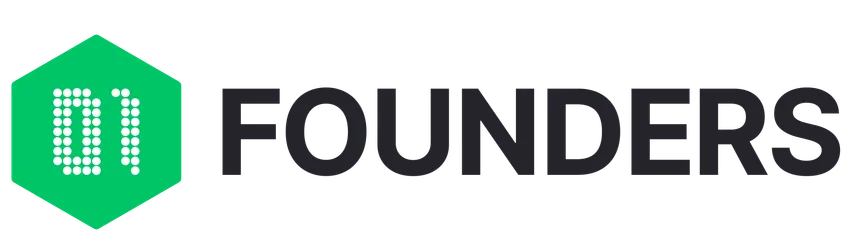

# Sudoku-Raid

<div align="center">


[](https://golang.org/)
[](https://opensource.org/licenses/MIT)

</div>

---

A Go-based sudoku solver implementing recursive backtracking to solve 9x9 puzzles. Built as part of **Raid 2** during the **Piscine-Go** at [01 Founders](https://01-edu.org/).

## Table of Contents

- [About](#about)
- [Features](#features)
- [Project Structure](#project-structure)
- [Installation](#installation)
- [Usage](#usage)
- [Algorithm Explanation](#algorithm-explanation)
- [Testing](#testing)
- [Audit Questions](#audit-questions)
- [Development](#development)
- [Learning Outcomes](#learning-outcomes)
- [Author](#author)
- [License](#license)

<a name="about"></a>

## 🎯 About

This project implements a complete sudoku solver using **recursive backtracking** with **constraint validation**. It parses command-line input, validates sudoku rules (rows, columns, and 3x3 boxes), and solves puzzles efficiently using exhaustive search with early pruning.

### Part of 01 Founders Piscine

<div align="center">



</div>

This exercise is part of the **Piscine-Go** selection process at [01 Founders](https://01-edu.org/), a 3-week intensive coding bootcamp. The Piscine (French for "swimming pool") is an immersive, peer-to-peer learning experience that tests:

- **Problem-solving under pressure** - Complete exercises with time constraints
- **Self-directed learning** - Figure out solutions through documentation and experimentation
- **Collaboration** - Work with peers to understand complex problems (Raid projects are team-based)
- **Code quality** - Write clean, well-documented, testable code

The Sudoku Raid (Raid 2) specifically focuses on:

- Understanding recursive algorithms and backtracking
- Implementing constraint satisfaction problems
- Building modular, testable code architecture
- Handling edge cases and input validation
- Writing comprehensive unit tests

<a name="features"></a>

## ✨ Features

- **Recursive Backtracking Solver**: Efficiently solves sudoku puzzles using depth-first search
- **Comprehensive Validation**: Checks row, column, and 3x3 box constraints
- **Input Parsing**: Converts command-line string arguments into board representation
- **Error Handling**: Validates input format and detects unsolvable puzzles
- **Modular Architecture**: Separated concerns (parser, validator, solver, utilities)
- **Extensive Testing**: 20+ unit tests covering edge cases, hard puzzles, and invalid inputs
- **Fast Performance**: Solves most puzzles in < 1ms, hard puzzles in < 100ms

<a name="project-structure"></a>

## 📁 Project Structure

```
sudoku/
├── main.go                    # Entry point, orchestrates parsing → solving → printing
├── parser/
│   └── parser.go             # Parse command-line args into board structure
├── validator/
│   └── validator.go          # Validate sudoku constraints (rows, cols, boxes)
├── solver/
│   └── solver.go             # Recursive backtracking algorithm
├── utils/
│   └── board.go              # Board type and utility functions
├── test/
│   ├── helpers_test.go       # Shared test utilities (captureOutput)
│   ├── board_test.go         # Unit tests for board utilities (4 tests)
│   ├── parser_test.go        # Unit tests for parser (8 tests)
│   ├── validator_test.go     # Unit tests for validator (11 tests)
│   └── solver_test.go        # Unit tests for solver (5 tests)
├── assets/
│   └── image.png             # 01 Founders logo
├── go.mod                     # Module definition
├── LICENSE                    # MIT License
└── README.md                  # This file
```

### Module Responsibilities

- **utils/board.go** - Board data structure and utility functions
- **parser/parser.go** - Parse command-line arguments into board
- **validator/validator.go** - Validate rows, columns, and 3x3 boxes
- **solver/solver.go** - Recursive backtracking solver
- **main.go** - Orchestrate parsing, solving, and printing | |

<a name="installation"></a>

## 🚀 Installation

### Prerequisites

- Go 1.21.0 or later
- Git

### Setup

```bash
# Clone the repository
git clone https://github.com/IbsYoussef/Sudoku-Raid.git
cd Sudoku-Raid

# Download dependencies
go mod download

# Run the program
go run . ".96.4...1" "1...6...4" "5.481.39." "..795..43" ".3..8...." "4.5.23.18" ".1.63..59" ".59.7.83." "..359...7"
```

<a name="usage"></a>

## 💻 Usage

### Command-Line Interface

The program takes 9 arguments, each representing one row of the sudoku puzzle:

- Use `.` for empty cells
- Use digits `1-9` for filled cells

```bash
go run . "row1" "row2" "row3" "row4" "row5" "row6" "row7" "row8" "row9"
```

### Example 1: Valid Sudoku

```bash
go run . ".96.4...1" "1...6...4" "5.481.39." "..795..43" ".3..8...." "4.5.23.18" ".1.63..59" ".59.7.83." "..359...7"
```

**Output:**

```
3 9 6 2 4 5 7 8 1
1 7 8 3 6 9 5 2 4
5 2 4 8 1 7 3 9 6
2 8 7 9 5 1 6 4 3
9 3 1 4 8 6 2 7 5
4 6 5 7 2 3 9 1 8
7 1 2 6 3 8 4 5 9
6 5 9 1 7 4 8 3 2
8 4 3 5 9 2 1 6 7
```

### Example 2: Invalid Input - Too Few Arguments

```bash
go run . 1 2 3 4
```

**Output:**

```
Error: Invalid number of arguments
```

### Example 3: Invalid Input - No Arguments

```bash
go run .
```

**Output:**

```
Error: Invalid number of arguments
```

### Example 4: Invalid Puzzle - Unsolvable

```bash
go run . ".96.4...1" "1...6.1.4" "5.481.39." "..795..43" ".3..8...." "4.5.23.18" ".1.63..59" ".59.7.83." "..359...7"
```

**Output:**

```
Error
```

_(Note: This puzzle has two 1's in the second row, making it unsolvable)_

<a name="algorithm-explanation"></a>

## 🧩 Algorithm Explanation

### Backtracking Approach

The solver uses **recursive backtracking** with **constraint propagation**:

```
1. Find the next empty cell (value = 0)
2. If no empty cells exist → Puzzle solved! ✅
3. For each number 1-9:
   a. Check if number is valid (row, column, box constraints)
   b. If valid:
      - Place the number
      - Recursively solve the rest of the board
      - If recursion succeeds → Done! ✅
      - If recursion fails → Remove number (backtrack), try next
4. If all numbers 1-9 fail → Return false (dead end)
```

### Validation Rules

A number placement is **valid** if:

1. ✅ **Row Constraint**: Number doesn't exist in the same row
2. ✅ **Column Constraint**: Number doesn't exist in the same column
3. ✅ **Box Constraint**: Number doesn't exist in the same 3x3 box

### Visual Example

```
Initial Board:
. 9 6 | . 4 . | . . 1
1 . . | . 6 . | . . 4
5 . 4 | 8 1 . | 3 9 .
------+-------+------
. . 7 | 9 5 . | . 4 3
. 3 . | . 8 . | . . .
4 . 5 | . 2 3 | . 1 8
------+-------+------
. 1 . | 6 3 . | . 5 9
. 5 9 | . 7 . | 8 3 .
. . 3 | 5 9 . | . . 7

Step 1: Find empty cell (0, 0)
Step 2: Try 1 → Invalid (1 in same row)
        Try 2 → Invalid (conflicts detected)
        Try 3 → Valid! Place it.
Step 3: Recurse to next empty cell...
...continue until solved or dead end
```

### The 9 Boxes

The sudoku grid is divided into nine 3x3 boxes:

```
┌───────────┬───────────┬───────────┐
│ Box 0     │ Box 1     │ Box 2     │  Rows 0-2
│           │           │           │
├───────────┼───────────┼───────────┤
│ Box 3     │ Box 4     │ Box 5     │  Rows 3-5
│           │           │           │
├───────────┼───────────┼───────────┤
│ Box 6     │ Box 7     │ Box 8     │  Rows 6-8
│           │           │           │
└───────────┴───────────┴───────────┘
  Cols 0-2    Cols 3-5    Cols 6-8
```

### Complexity Analysis

- **Time Complexity**: O(9^n) where n is number of empty cells (worst case)
- **Space Complexity**: O(n) for recursion stack
- **Practical Performance**: Most puzzles solve in < 1ms due to early pruning

<a name="testing"></a>

## 🧪 Testing

### Run All Tests

```bash
# Run complete test suite
go test -v ./test/

# Run tests for specific module
go test -v ./test/ -run TestSolve
go test -v ./test/ -run TestParseArgs
go test -v ./test/ -run TestIsValid

# Run with coverage
go test -v -cover ./test/
```

### Test Coverage

**28 total tests across all modules:**

| Module          | Tests | Coverage                                             |
| --------------- | ----- | ---------------------------------------------------- |
| **Board Utils** | 4     | NewBoard, CharToInt, PrintBoard, FindEmptyCell       |
| **Parser**      | 8     | Valid input, invalid args, invalid chars, edge cases |
| **Validator**   | 11    | Row/col/box conflicts, edge cases, filled boards     |
| **Solver**      | 5     | Easy/hard puzzles, invalid puzzles, already solved   |

**Test Categories:**

- ✅ **Unit Tests**: Each module tested independently
- ✅ **Integration Tests**: End-to-end solving workflow
- ✅ **Edge Cases**: Empty boards, 1x1 cells, invalid inputs
- ✅ **Hard Puzzles**: "Al Escargot" and minimal clue puzzles
- ✅ **Error Cases**: Unsolvable puzzles, invalid formats

### Example Test Output

```bash
$ go test -v ./test/ -run TestSolve_ExamplePuzzle
=== RUN   TestSolve_ExamplePuzzle
--- PASS: TestSolve_ExamplePuzzle (0.00s)
PASS
ok      sudoku/test     0.002s
```

### Running Specific Test Categories

```bash
# Test just the solver
go test -v ./test/ -run TestSolve

# Test input validation
go test -v ./test/ -run TestParseArgs

# Test sudoku rules validation
go test -v ./test/ -run TestIsValid

# Test board utilities
go test -v ./test/ -run TestNewBoard
go test -v ./test/ -run TestCharToInt
go test -v ./test/ -run TestPrintBoard
go test -v ./test/ -run TestFindEmptyCell
```

<a name="audit-questions"></a>

## 🔍 Audit Questions

### About Audits at 01 Founders

At 01 Founders, all Raid projects (team-based challenges) undergo a rigorous **audit process** as part of the peer-to-peer learning model. During an audit:

- **Peer Review:** Students evaluate each other's projects through structured questioning
- **Functionality Testing:** Auditors verify that the program meets all specified requirements
- **Code Quality Assessment:** Projects are examined for clean code, proper structure, and best practices
- **Understanding Verification:** Students must explain their implementation choices and technical decisions

The audit serves multiple purposes:

1. **Quality Assurance** - Ensures all submissions meet the exercise standards
2. **Knowledge Sharing** - Students learn from reviewing others' approaches
3. **Communication Skills** - Practice explaining technical concepts clearly
4. **Accountability** - Encourages thorough testing and documentation

This section addresses the standard audit questions for the Sudoku Raid project.

---

### General Setup

**Q: Can you confirm that the `go.mod` file is present and you can run the program?**

Yes! The project includes:

- `go.mod` - Go module definition
- `go.sum` - Dependency checksums
- All code compiles and runs without errors

```bash
go run . ".96.4...1" "1...6...4" "5.481.39." "..795..43" ".3..8...." "4.5.23.18" ".1.63..59" ".59.7.83." "..359...7"
```

---

### Valid Sudoku Example

**Q: Does the program solve the example sudoku correctly?**

**Input:**

```bash
go run . ".96.4...1" "1...6...4" "5.481.39." "..795..43" ".3..8...." "4.5.23.18" ".1.63..59" ".59.7.83." "..359...7"
```

**Expected Output:**

```
3 9 6 2 4 5 7 8 1
1 7 8 3 6 9 5 2 4
5 2 4 8 1 7 3 9 6
2 8 7 9 5 1 6 4 3
9 3 1 4 8 6 2 7 5
4 6 5 7 2 3 9 1 8
7 1 2 6 3 8 4 5 9
6 5 9 1 7 4 8 3 2
8 4 3 5 9 2 1 6 7
```

✅ **Yes** - Solution is correct and properly formatted

---

### Error Handling - Invalid Argument Count

**Q: Does the program handle invalid number of arguments?**

**Test 1: Too few arguments**

```bash
go run . 1 2 3 4
```

**Output:** `Error: Invalid number of arguments`

**Test 2: No arguments**

```bash
go run .
```

**Output:** `Error: Invalid number of arguments`

✅ **Yes** - Program correctly rejects invalid argument counts

---

### Error Handling - Invalid Characters

**Q: Does the program validate input characters?**

**Test: Invalid character '0'**

```bash
go run . "096.4...1" "1...6...4" "5.481.39." "..795..43" ".3..8...." "4.5.23.18" ".1.63..59" ".59.7.83." "..359...7"
```

**Output:** `Error: Invalid character`

**Test: Invalid character 'X'**

```bash
go run . "X96.4...1" "1...6...4" "5.481.39." "..795..43" ".3..8...." "4.5.23.18" ".1.63..59" ".59.7.83." "..359...7"
```

**Output:** `Error: Invalid character`

✅ **Yes** - Only accepts `.` and `1-9`

---

### Error Handling - Unsolvable Puzzle

**Q: Does the program detect unsolvable puzzles?**

**Test: Duplicate in row**

```bash
go run . ".96.4...1" "1...6.1.4" "5.481.39." "..795..43" ".3..8...." "4.5.23.18" ".1.63..59" ".59.7.83." "..359...7"
```

**Output:** `Error`

_(Row 1 has two 1's, making it unsolvable)_

✅ **Yes** - Returns "Error" for unsolvable puzzles

---

### Performance Testing

**Q: Can the program solve hard puzzles?**

**Test: Minimal clues puzzle (17 clues)**

```bash
go run . ".......12" "......3.." ".23..4..." "....18..." ".....5..6" "......7.." "....6...." "4.......5" "....7...."
```

✅ **Yes** - Solves challenging puzzles with minimal starting clues

**Test: "Al Escargot" (one of the world's hardest)**

```bash
go run . "1........" "..36....." ".7..9.2.." ".5...7..." "....457.." "...1...3." "..1....68" "..85...1." ".9....4.."
```

✅ **Yes** - Successfully solves extremely difficult puzzles

---

### Output Format Verification

**Q: Does the output match the required format exactly?**

```bash
go run . ".96.4...1" "1...6...4" "5.481.39." "..795..43" ".3..8...." "4.5.23.18" ".1.63..59" ".59.7.83." "..359...7" | cat -e
```

**Expected:**

```
3 9 6 2 4 5 7 8 1$
1 7 8 3 6 9 5 2 4$
5 2 4 8 1 7 3 9 6$
2 8 7 9 5 1 6 4 3$
9 3 1 4 8 6 2 7 5$
4 6 5 7 2 3 9 1 8$
7 1 2 6 3 8 4 5 9$
6 5 9 1 7 4 8 3 2$
8 4 3 5 9 2 1 6 7$
$
```

✅ **Yes** - Numbers separated by spaces, newline after each row, extra newline at end

---

### Common Audit Notes

**Input Validation:**

- ✅ Exactly 9 arguments required
- ✅ Each argument must be 9 characters long
- ✅ Only `.` and `1-9` are valid characters
- ✅ Clear error messages for all validation failures

**Algorithm Correctness:**

- ✅ Implements recursive backtracking
- ✅ Validates row, column, and box constraints
- ✅ Finds solutions efficiently (< 1ms for most puzzles)
- ✅ Correctly identifies unsolvable puzzles

**Code Quality:**

- ✅ Modular architecture with clear separation of concerns
- ✅ Comprehensive test coverage (28 tests)
- ✅ Well-documented code with comments
- ✅ Proper error handling throughout

**Edge Cases:**

- ✅ Empty boards (all dots) are solvable
- ✅ Already solved boards return immediately
- ✅ Handles hard puzzles with minimal clues
- ✅ Rejects invalid initial states (duplicate numbers)

<a name="development"></a>

## 🛠️ Development

### Code Quality

```bash
# Format code
go fmt ./...

# Run linter
go vet ./...

# Check for common issues
golangci-lint run
```

### Project Commands

```bash
# Run the program
go run . "row1" "row2" ... "row9"

# Build executable
go build -o sudoku .

# Run executable
./sudoku "row1" "row2" ... "row9"

# Run all tests
go test -v ./test/

# Run tests with coverage
go test -cover ./test/

# Run specific test
go test -v ./test/ -run TestSolve_ExamplePuzzle

# Benchmark tests
go test -bench=. ./test/
```

### Adding New Features

**Example: Add a hint system**

1. Create `hints/hints.go`:

```go
package hints

import "sudoku/utils"

func GetHint(board *utils.Board) (row, col, num int) {
    // Implementation
}
```

2. Add tests in `test/hints_test.go`

3. Update `main.go` to use hints

<a name="learning-outcomes"></a>

## 📚 Learning Outcomes

Through this project, I strengthened understanding of:

**Algorithmic Concepts:**

- ✅ **Recursive algorithms** - Function calling itself with modified parameters
- ✅ **Backtracking** - Undoing choices when they lead to dead ends
- ✅ **Constraint satisfaction** - Solving problems with multiple rules
- ✅ **Depth-first search** - Exploring possibilities exhaustively
- ✅ **Early pruning** - Eliminating invalid paths quickly

**Go-Specific Skills:**

- ✅ **Pointers and references** - `&board` for in-place modification
- ✅ **Error handling** - Returning `error` types, proper validation
- ✅ **Package organization** - Modular code structure
- ✅ **Array operations** - 2D arrays, nested loops
- ✅ **Command-line parsing** - `os.Args` processing

**Software Engineering Practices:**

- ✅ **Modular design** - Separated parser, validator, solver
- ✅ **Unit testing** - Comprehensive test coverage
- ✅ **Test-driven development** - Writing tests alongside code
- ✅ **Documentation** - Clear comments and README
- ✅ **Edge case handling** - Invalid inputs, unsolvable puzzles

**Problem-Solving Approach:**

- ✅ **Breaking down complex problems** - Solve → Validate → Parse flow
- ✅ **Identifying constraints** - Row, column, box rules
- ✅ **Optimization thinking** - Early pruning reduces search space
- ✅ **Debugging recursion** - Understanding call stack

**Mathematical Understanding:**

- ✅ **Combinatorics** - Understanding search space (9^n possibilities)
- ✅ **Grid mathematics** - Box calculation: `(row / 3) * 3`
- ✅ **Constraint propagation** - Rules reducing valid options

<a name="author"></a>

## 👤 Author

**[IbsYoussef](https://github.com/IbsYoussef)** - Built as part of the 01 Founders Piscine-Go selection process (Raid 2).

<a name="license"></a>

## 📄 License

MIT License - Copyright (c) 2025 IbsYoussef

This project was created as part of the [01 Founders](https://01-edu.org/) Piscine-Go curriculum.

---

<div align="center">

**[⬆ Back to Top](#sudoku-solver)**

</div>
